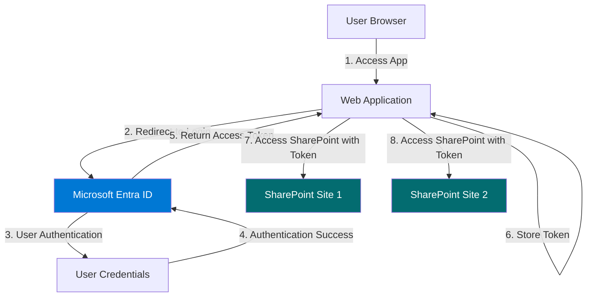
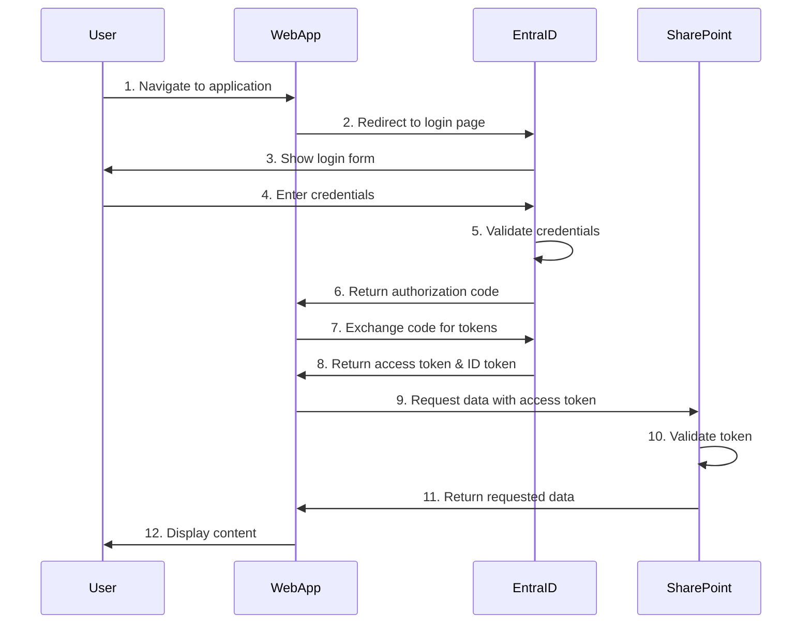

# SSO Implementation Overview - Microsoft Entra ID with SharePoint

## Introduction

This document provides a comprehensive overview of implementing Single Sign-On (SSO) using Microsoft Entra ID (formerly Azure Active Directory) to authenticate users and access SharePoint sites.

## What is SSO?

Single Sign-On (SSO) is an authentication method that allows users to access multiple applications with one set of login credentials. Once authenticated, users can seamlessly access various resources without re-entering credentials.

## Architecture Overview

## Key Components

### 1. Microsoft Entra ID (Azure AD)
- **Identity Provider**: Manages user identities and authentication
- **Token Issuer**: Issues OAuth 2.0 access tokens and ID tokens
- **Authorization Server**: Controls access to resources

### 2. Web Application
- **Client Application**: Your custom web app that users interact with
- **Authentication Handler**: Manages the OAuth 2.0 flow
- **Token Storage**: Securely stores access tokens

### 3. SharePoint Sites
- **Protected Resources**: The SharePoint sites requiring authentication
- **Resource Server**: Validates tokens and grants access

## Authentication Flow

## OAuth 2.0 Authorization Code Flow

This implementation uses the **Authorization Code Flow with PKCE** (Proof Key for Code Exchange), which is the recommended approach for web applications.

### Flow Steps:

1. **User Initiates Login**: User clicks "Sign In" button
2. **Authorization Request**: App redirects to Entra ID with:
   - Client ID
   - Redirect URI
   - Requested scopes (permissions)
   - PKCE code challenge
3. **User Authentication**: User enters credentials in Entra ID
4. **Authorization Code**: Entra ID returns authorization code
5. **Token Exchange**: App exchanges code for tokens
6. **Access Token**: App receives access token and ID token
7. **API Calls**: App uses access token to call SharePoint APIs

## Required Permissions (Scopes)

For SharePoint access, the application needs:

- `User.Read`: Read user profile
- `Sites.Read.All`: Read items in all site collections
- `Files.Read.All`: Read files in all site collections (if needed)
- `offline_access`: Get refresh tokens for long-term access

## Security Considerations

1. **Token Storage**: Store tokens securely (httpOnly cookies or secure storage)
2. **HTTPS Only**: Always use HTTPS in production
3. **Token Expiration**: Implement token refresh logic
4. **PKCE**: Use PKCE to prevent authorization code interception
5. **State Parameter**: Prevent CSRF attacks
6. **Scope Limitation**: Request only necessary permissions

## Benefits of SSO

1. **Improved User Experience**: Single login for multiple resources
2. **Enhanced Security**: Centralized authentication and authorization
3. **Reduced Password Fatigue**: Fewer passwords to remember
4. **Simplified Management**: Centralized user management
5. **Audit Trail**: Centralized logging and monitoring

## Your SharePoint Sites

- **Site 1**: https://xxx.sharepoint.com/sites/yoursite/SitePages/CollabHome.aspx
- **Site 2**: https://xxx.sharepoint.com/sites/yoursite2/SitePages/CollabHome.aspx

## Test Users

- `admin@mail.com` (Administrator)
- `user1@mail.com` (User)
- `user2@mail.com` (User)

## Next Steps

1. Register application in Azure Portal
2. Configure authentication settings
3. Implement web application
4. Test SSO flow
5. Deploy to production

---

**Document Version**: 1.0  
**Last Updated**: 2026-03-13