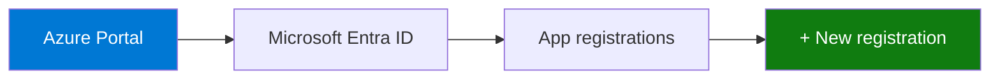
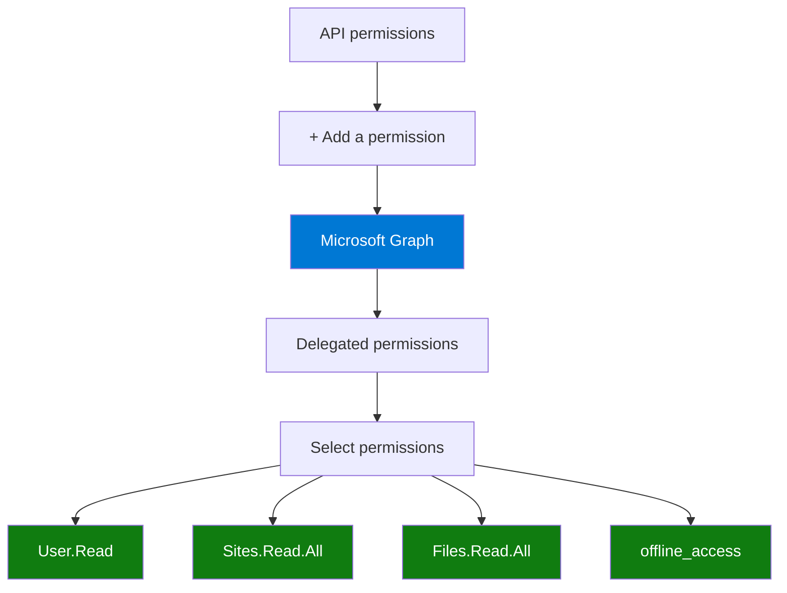
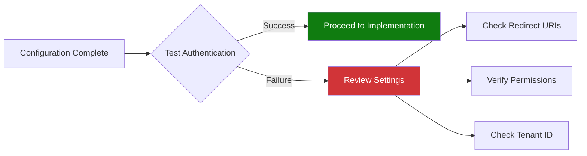

# Azure Portal Setup Guide - Entra ID App Registration

## Prerequisites

- Azure subscription with admin access
- Access to Azure Portal (https://portal.azure.com)
- Tenant: 3w2lyf.onmicrosoft.com

## Step 1: Register Application in Azure Portal

### 1.1 Navigate to App Registrations



1. Sign in to [Azure Portal](https://portal.azure.com)
2. Search for "Microsoft Entra ID" or "Azure Active Directory"
3. Click on **App registrations** in the left menu
4. Click **+ New registration**

### 1.2 Configure Application Registration

Fill in the following details:

| Field | Value | Description |
|-------|-------|-------------|
| **Name** | `SharePoint SSO Demo` | Display name for your application |
| **Supported account types** | Accounts in this organizational directory only (3w2lyf only - Single tenant) | Restricts access to your organization |
| **Redirect URI** | Platform: **Single-page application (SPA)**<br>URI: `http://localhost:3000` | Where Entra ID sends authentication responses |

Click **Register**

### 1.3 Note Important Values

After registration, note these values (you'll need them later):

```
Application (client) ID: [COPY THIS VALUE]
Directory (tenant) ID: [COPY THIS VALUE]
```

Example format:
```
Client ID: 12345678-1234-1234-1234-123456789abc
Tenant ID: 87654321-4321-4321-4321-cba987654321
```

## Step 2: Configure Authentication

### 2.1 Add Redirect URIs

1. Go to **Authentication** in the left menu
2. Under **Single-page application**, add these redirect URIs:
   - `http://localhost:3000`
   - `http://localhost:3000/callback`
   - `http://localhost:8080` (alternative port)

### 2.2 Configure Implicit Grant and Hybrid Flows

⚠️ **CRITICAL FOR PKCE FIX**: This step is required to avoid PKCE errors!

Under **Implicit grant and hybrid flows**, check:
- ✅ **Access tokens** (used for implicit flows)
- ✅ **ID tokens** (used for implicit and hybrid flows)

**Why this is important:**
- Our application uses implicit flow to avoid PKCE (Proof Key for Code Exchange) requirements
- PKCE requires Web Crypto API which may not be available in all browsers
- Implicit flow is simpler and works universally
- Without these checkboxes enabled, you'll get PKCE errors

**Screenshot reference:**
```
Implicit grant and hybrid flows
☑ Access tokens (used for implicit flows)      ← MUST BE CHECKED
☑ ID tokens (used for implicit and hybrid flows) ← MUST BE CHECKED
```

### 2.3 Configure Advanced Settings

Under **Advanced settings**:
- **Allow public client flows**: No
- **Enable the following mobile and desktop flows**: No

Click **Save**

## Step 3: Configure API Permissions

### 3.1 Add Microsoft Graph Permissions



1. Click **API permissions** in the left menu
2. Click **+ Add a permission**
3. Select **Microsoft Graph**
4. Select **Delegated permissions**
5. Search and add these permissions:
   - `User.Read` - Sign in and read user profile
   - `Sites.Read.All` - Read items in all site collections
   - `Files.Read.All` - Read all files that user can access
   - `offline_access` - Maintain access to data you have given it access to

6. Click **Add permissions**

### 3.2 Grant Admin Consent

⚠️ **Important**: Some permissions require admin consent.

1. Click **Grant admin consent for 3w2lyf**
2. Click **Yes** to confirm
3. Verify all permissions show "Granted for 3w2lyf" in green

## Step 4: Configure Token Configuration (Optional)

### 4.1 Add Optional Claims

1. Click **Token configuration** in the left menu
2. Click **+ Add optional claim**
3. Select **ID** token type
4. Add these claims:
   - `email`
   - `family_name`
   - `given_name`
   - `upn` (User Principal Name)

5. Click **Add**

## Step 5: Create Client Secret (For Server-Side Apps)

⚠️ **Note**: For Single-Page Applications (SPA), you typically don't need a client secret. This is only for server-side applications.

If needed:
1. Click **Certificates & secrets**
2. Click **+ New client secret**
3. Add description: "SSO Demo Secret"
4. Select expiration: 6 months (or as needed)
5. Click **Add**
6. **Copy the secret value immediately** (you won't see it again!)

## Step 6: Configure Branding (Optional)

1. Click **Branding & properties**
2. Set:
   - **Name**: SharePoint SSO Demo
   - **Home page URL**: http://localhost:3000
   - **Logo**: Upload your logo (optional)
   - **Terms of service URL**: (optional)
   - **Privacy statement URL**: (optional)

3. Click **Save**

## Step 7: Verify Configuration

### Configuration Checklist

- ✅ Application registered
- ✅ Client ID and Tenant ID noted
- ✅ Redirect URIs configured
- ✅ API permissions added and granted
- ✅ Authentication settings configured

### Test Configuration



## Configuration Summary

After completing these steps, you should have:

```json
{
  "clientId": "YOUR_CLIENT_ID",
  "tenantId": "YOUR_TENANT_ID",
  "redirectUri": "http://localhost:3000",
  "scopes": [
    "User.Read",
    "Sites.Read.All",
    "Files.Read.All",
    "offline_access"
  ]
}
```

## Common Issues and Solutions

### Issue 1: "AADSTS50011: The reply URL specified in the request does not match"
**Solution**: Verify redirect URI in Azure matches exactly with your app configuration

### Issue 2: "AADSTS65001: The user or administrator has not consented"
**Solution**: Grant admin consent for the required permissions

### Issue 3: "AADSTS700016: Application not found in the directory"
**Solution**: Verify you're using the correct tenant ID and client ID

## Next Steps

1. ✅ Azure configuration complete
2. ➡️ Proceed to implement the web application
3. ➡️ Test SSO flow with SharePoint sites

## Useful Links

- [Azure Portal](https://portal.azure.com)
- [Microsoft Entra ID Documentation](https://learn.microsoft.com/en-us/entra/identity/)
- [Microsoft Graph API Reference](https://learn.microsoft.com/en-us/graph/api/overview)
- [SharePoint REST API](https://learn.microsoft.com/en-us/sharepoint/dev/sp-add-ins/get-to-know-the-sharepoint-rest-service)

---

**Document Version**: 1.0  
**Last Updated**: 2026-03-13