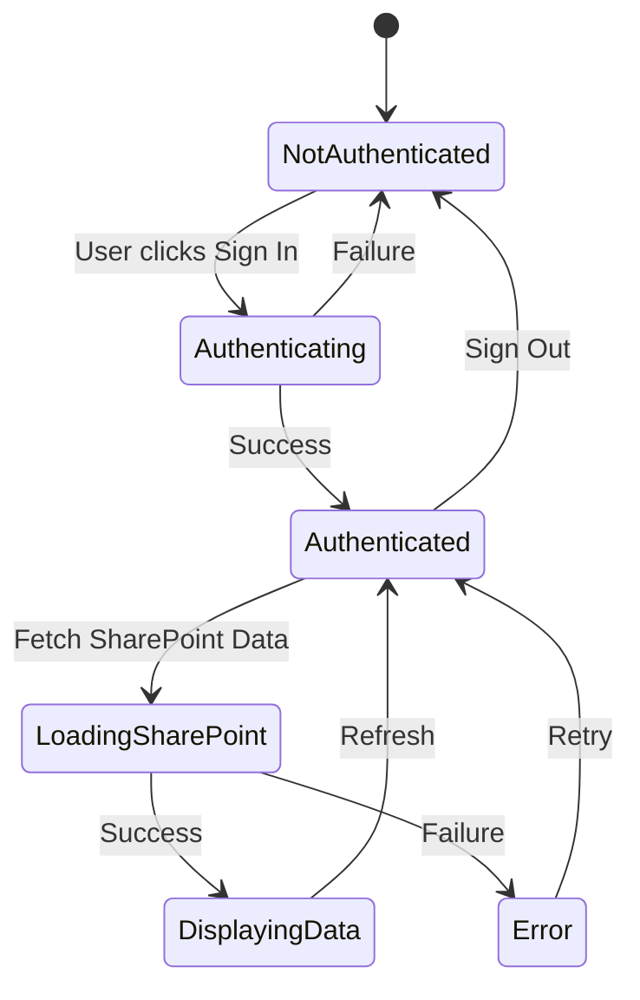
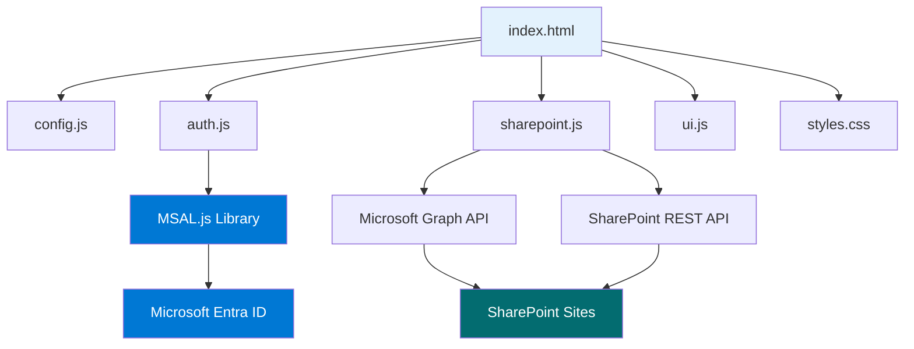
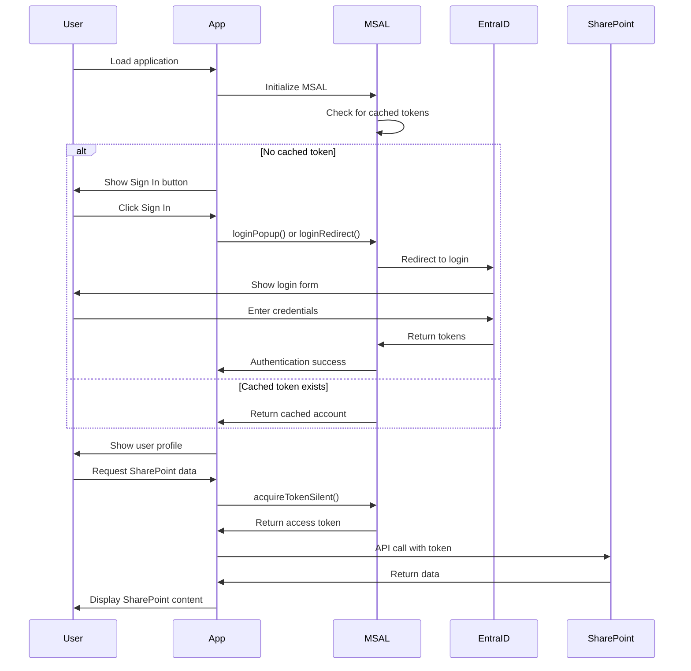
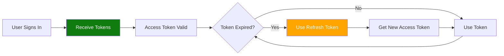
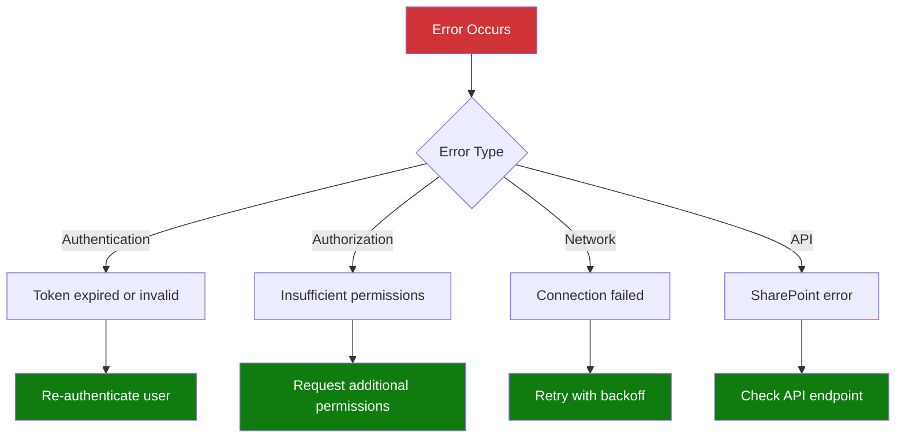
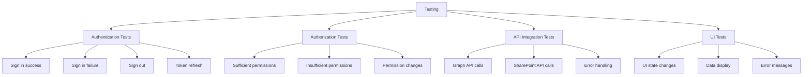

# Implementation Guide - SSO Web Application

## Technology Stack

This implementation uses:
- **HTML5/CSS3**: Frontend structure and styling
- **JavaScript (Vanilla)**: Client-side logic
- **MSAL.js 2.x**: Microsoft Authentication Library for JavaScript
- **Microsoft Graph API**: Access SharePoint data
- **SharePoint REST API**: Direct SharePoint operations

## Project Structure

```
ms-sso/
├── Docs/
│   ├── 01-SSO-Overview.md
│   ├── 02-Azure-Setup-Guide.md
│   └── 03-Implementation-Guide.md
├── scripts/
│   ├── config.js              # Configuration file
│   ├── auth.js                # Authentication logic
│   ├── sharepoint.js          # SharePoint API calls
│   └── ui.js                  # UI interactions
├── index.html                 # Main application page
├── styles.css                 # Application styles
└── README.md                  # Quick start guide
```

## Application Flow



## Component Architecture



## Key Components Explained

### 1. Configuration (config.js)

Stores all application configuration:
- Client ID from Azure
- Tenant ID
- Redirect URI
- API scopes
- SharePoint site URLs

### 2. Authentication (auth.js)

Handles all authentication operations:
- Initialize MSAL instance
- Sign in/Sign out
- Acquire tokens
- Handle redirects
- Token caching

### 3. SharePoint Integration (sharepoint.js)

Manages SharePoint API calls:
- Fetch site information
- Get lists and libraries
- Retrieve documents
- Access user permissions

### 4. UI Management (ui.js)

Controls user interface:
- Show/hide elements
- Display user info
- Render SharePoint data
- Handle errors
- Loading states

## Authentication Flow Details



## Token Management

### Token Types

1. **ID Token**: Contains user identity information
   - User name
   - Email
   - Object ID
   - Claims

2. **Access Token**: Used to call APIs
   - Short-lived (typically 1 hour)
   - Contains permissions (scopes)
   - Must be included in API requests

3. **Refresh Token**: Used to get new access tokens
   - Long-lived
   - Stored securely by MSAL
   - Used automatically by MSAL

### Token Lifecycle



## API Integration

### Microsoft Graph API

Used for:
- User profile information
- SharePoint site metadata
- Cross-site operations

**Endpoint**: `https://graph.microsoft.com/v1.0/`

Example calls:
```javascript
// Get user profile
GET https://graph.microsoft.com/v1.0/me

// Get SharePoint site
GET https://graph.microsoft.com/v1.0/sites/{site-id}

// Get site lists
GET https://graph.microsoft.com/v1.0/sites/{site-id}/lists
```

### SharePoint REST API

Used for:
- Site-specific operations
- List and library access
- Document operations

**Endpoint**: `https://{tenant}.sharepoint.com/sites/{site}/_api/`

Example calls:
```javascript
// Get site information
GET https://3w2lyf.sharepoint.com/sites/aamSite/_api/web

// Get lists
GET https://3w2lyf.sharepoint.com/sites/aamSite/_api/web/lists

// Get list items
GET https://3w2lyf.sharepoint.com/sites/aamSite/_api/web/lists/getbytitle('Documents')/items
```

## Error Handling

### Common Errors and Solutions



### Error Handling Strategy

1. **Authentication Errors**: Prompt user to sign in again
2. **Authorization Errors**: Display permission requirements
3. **Network Errors**: Implement retry logic with exponential backoff
4. **API Errors**: Log error details and show user-friendly message

## Security Best Practices

### 1. Token Storage
- ✅ MSAL handles token storage securely
- ✅ Tokens stored in browser's session/local storage
- ✅ Never expose tokens in URLs or logs

### 2. HTTPS Only
- ✅ Use HTTPS in production
- ✅ Redirect HTTP to HTTPS
- ⚠️ HTTP allowed only for localhost development

### 3. Scope Limitation
- ✅ Request only necessary permissions
- ✅ Use least privilege principle
- ✅ Document why each permission is needed

### 4. CORS Configuration
- ✅ Configure proper CORS headers
- ✅ Whitelist only trusted origins
- ✅ Validate redirect URIs

### 5. State Parameter
- ✅ MSAL automatically includes state parameter
- ✅ Prevents CSRF attacks
- ✅ Validates authentication responses

## Performance Optimization

### 1. Token Caching
```javascript
// MSAL automatically caches tokens
// Silent token acquisition is fast
const token = await msalInstance.acquireTokenSilent(request);
```

### 2. Lazy Loading
```javascript
// Load SharePoint data only when needed
// Don't fetch all data on page load
```

### 3. Batch Requests
```javascript
// Use Microsoft Graph batch API for multiple requests
POST https://graph.microsoft.com/v1.0/$batch
```

### 4. Pagination
```javascript
// Handle large result sets with pagination
// Use @odata.nextLink for subsequent pages
```

## Testing Strategy

### Test Scenarios



### Test Users

Test with all three users to verify different permission levels:
- `adminAlainAirom@3w2lyf.onmicrosoft.com` - Admin access
- `user1@3w2lyf.onmicrosoft.com` - Standard user
- `user2@3w2lyf.onmicrosoft.com` - Standard user

## Deployment Considerations

### Development Environment
- Use `http://localhost:3000`
- Configure redirect URI in Azure
- Enable browser console for debugging

### Production Environment
- Use HTTPS with valid SSL certificate
- Update redirect URIs in Azure
- Implement proper error logging
- Set up monitoring and analytics
- Configure CDN for static assets

## Monitoring and Logging

### What to Log

1. **Authentication Events**
   - Sign in attempts
   - Sign in success/failure
   - Token acquisition
   - Sign out events

2. **API Calls**
   - Request URLs
   - Response status codes
   - Error messages
   - Response times

3. **User Actions**
   - Page navigation
   - Button clicks
   - Data requests

### Logging Best Practices

- ❌ Never log tokens or credentials
- ❌ Never log personal information (PII)
- ✅ Log error details for debugging
- ✅ Log performance metrics
- ✅ Use structured logging format

## Next Steps

1. ✅ Understand architecture and flow
2. ➡️ Implement configuration file
3. ➡️ Implement authentication logic
4. ➡️ Implement SharePoint integration
5. ➡️ Create user interface
6. ➡️ Test with all users

---

**Document Version**: 1.0  
**Last Updated**: 2026-03-13