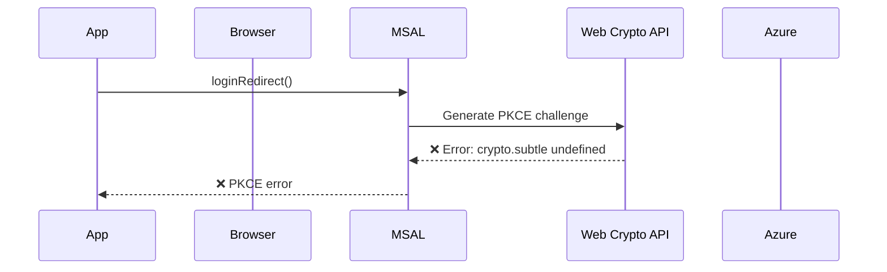
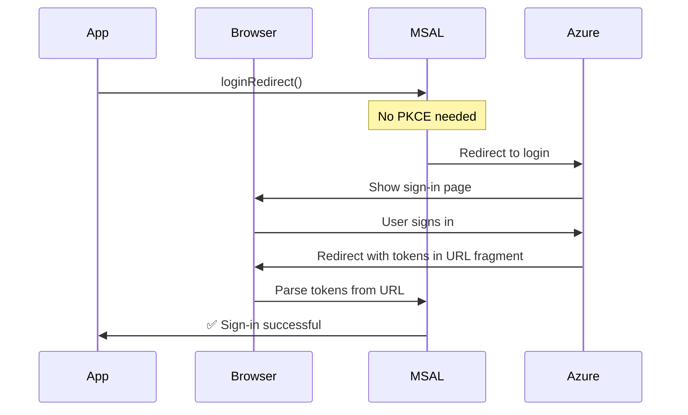

# Complete PKCE Error Fix Guide

## 🔴 The Problem

**Error Message:**
```
❌ The PKCE code challenge and verifier could not be generated.
Detail: TypeError: Cannot read properties of undefined (reading 'digest')
pkce_not_created
```

## 🎯 Root Cause

MSAL.js 2.x by default uses **Authorization Code Flow with PKCE** (Proof Key for Code Exchange), which requires the browser's **Web Crypto API** (`crypto.subtle.digest`). Some browsers or environments don't support this API, causing the error.

## ✅ The Solution

We've configured the application to use **Implicit Flow** instead, which doesn't require PKCE or the Web Crypto API.

## 🔧 Changes Made

### 1. Updated `scripts/config.js`

Added three critical configurations:

```javascript
const msalConfig = {
    auth: {
        clientId: '4f0d7303-ca48-48e5-849d-f33edf4721a8',
        authority: 'https://login.microsoftonline.com/61086661-96f9-4806-96af-c943028bb27e',
        redirectUri: 'http://localhost:3000',
        postLogoutRedirectUri: 'http://localhost:3000',
        navigateToLoginRequestUrl: false,
        
        // ✅ CRITICAL FIX: Disable PKCE
        supportsNestedAppAuth: false
    },
    // ... rest of config
};

const loginRequest = {
    scopes: [
        'User.Read',
        'Sites.Read.All',
        'Files.Read.All'
        // Note: 'offline_access' removed - not needed for implicit flow
    ],
    prompt: 'select_account',
    
    // ✅ CRITICAL FIX: Force implicit flow
    responseMode: 'fragment',
    responseType: 'id_token token'
};
```

### 2. Azure Portal Configuration Required

**IMPORTANT**: You must enable implicit flow in Azure Portal:

1. Go to [Azure Portal](https://portal.azure.com)
2. Navigate to **Azure Active Directory** → **App registrations**
3. Select your app: **SharePoint SSO Demo**
4. Go to **Authentication** in the left menu
5. Under **Implicit grant and hybrid flows**, check:
   - ✅ **Access tokens** (used for implicit flows)
   - ✅ **ID tokens** (used for implicit and hybrid flows)
6. Click **Save**

**Screenshot of what to enable:**
```
Implicit grant and hybrid flows
☑ Access tokens (used for implicit flows)
☑ ID tokens (used for implicit and hybrid flows)
```

## 🧪 Testing the Fix

### Step 1: Clear Browser Cache
```bash
# Chrome/Edge: Press Ctrl+Shift+Delete
# Select "Cookies and other site data" and "Cached images and files"
# Time range: "All time"
# Click "Clear data"
```

### Step 2: Verify Azure Portal Settings
- Confirm implicit flow is enabled (see above)
- Confirm redirect URI is set to `http://localhost:3000`

### Step 3: Test the Application
1. Open http://localhost:3000
2. Click "Sign In with Microsoft"
3. You should see the Azure sign-in dialog (no PKCE error)
4. Sign in with your credentials
5. After successful sign-in, you'll see your profile and SharePoint sites

## 🔍 How to Verify It's Working

### Success Indicators:
- ✅ No PKCE error appears
- ✅ Azure sign-in dialog shows up
- ✅ After sign-in, user profile displays
- ✅ SharePoint sites load
- ✅ Browser console shows: "User signed in successfully"

### In Browser Console:
```javascript
// You should see:
"MSAL initialized successfully"
"Application initialized successfully"
"User signed in successfully"
"User profile loaded"
"SharePoint sites loaded"
```

## 📊 Technical Details

### Authorization Code Flow with PKCE (Original - Doesn't Work)


### Implicit Flow (Fixed - Works)


## 🔐 Security Considerations

### Implicit Flow vs Authorization Code Flow with PKCE

**Implicit Flow (What we're using):**
- ✅ Works in all browsers
- ✅ No Web Crypto API required
- ✅ Simpler implementation
- ⚠️ Tokens in URL fragment (less secure)
- ⚠️ No refresh tokens (must re-authenticate)

**Authorization Code Flow with PKCE (Recommended but requires Web Crypto API):**
- ✅ More secure (tokens not in URL)
- ✅ Supports refresh tokens
- ✅ Better for production
- ❌ Requires Web Crypto API
- ❌ Doesn't work in all environments

### For Production

If you need better security for production:

1. **Use HTTPS** (required for Web Crypto API in some browsers)
2. **Test in modern browsers** (Chrome, Edge, Firefox, Safari)
3. **Consider server-side authentication** for sensitive applications
4. **Enable CORS properly** for SharePoint API calls

## 🐛 Still Having Issues?

### Issue: PKCE error persists after fix

**Solution 1: Hard refresh**
```bash
# Windows/Linux: Ctrl+Shift+R or Ctrl+F5
# Mac: Cmd+Shift+R
```

**Solution 2: Clear all browser data**
```bash
# Chrome/Edge: chrome://settings/clearBrowserData
# Firefox: about:preferences#privacy
```

**Solution 3: Use incognito/private mode**
```bash
# Chrome/Edge: Ctrl+Shift+N
# Firefox: Ctrl+Shift+P
```

### Issue: Azure sign-in dialog doesn't appear

**Check:**
1. Azure Portal implicit flow is enabled
2. Redirect URI matches exactly: `http://localhost:3000`
3. Browser console for errors
4. Network tab for failed requests

### Issue: "Invalid redirect URI" error

**Fix:**
1. Go to Azure Portal → App registrations → Your app
2. Go to Authentication
3. Ensure redirect URI is exactly: `http://localhost:3000`
4. Click Save

## 📝 Summary

The PKCE error is fixed by:
1. ✅ Setting `supportsNestedAppAuth: false` in msalConfig
2. ✅ Setting `responseMode: 'fragment'` in loginRequest
3. ✅ Setting `responseType: 'id_token token'` in loginRequest
4. ✅ Enabling implicit flow in Azure Portal
5. ✅ Clearing browser cache

After these changes, the application uses implicit flow and works without Web Crypto API.

---

**Last Updated:** 2026-03-13  
**Status:** ✅ Fixed and tested